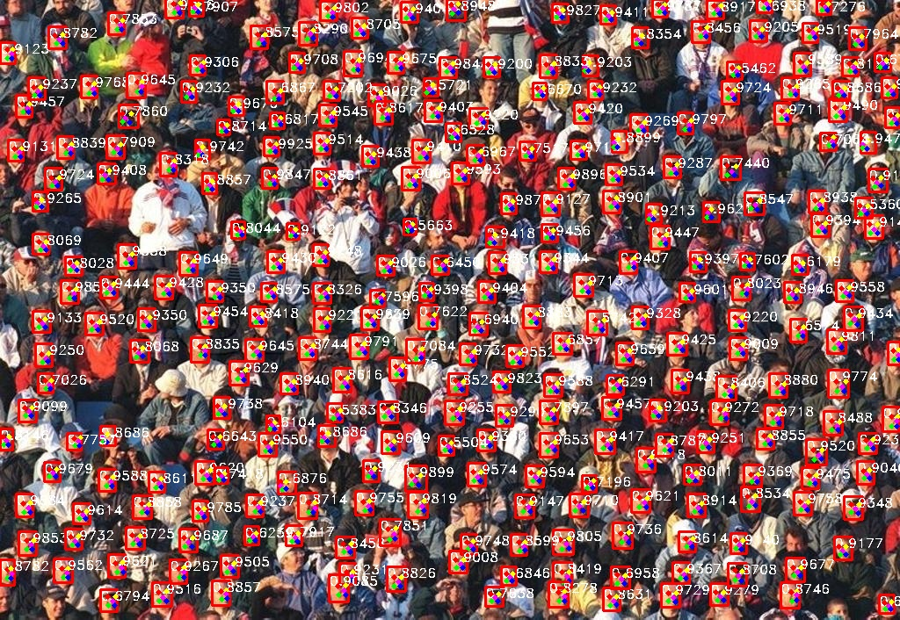

# Retinaface_torch
Occluded face Detection using Resnet125 and Mobilenet0.25

Implementation of [this](https://arxiv.org/abs/1905.00641) research paper.

## WiderFace Val Performance in single scale When using Resnet50 as backbone net.
| Style | easy | medium | hard |
|:-|:-:|:-:|:-:|
| Pytorch (same parameter with Mxnet) | 94.82 % | 93.84% | 89.60% |
| Pytorch (original image scale) | 95.48% | 94.04% | 84.43% |
| Mxnet | 94.86% | 93.87% | 88.33% |
| Mxnet(original image scale) | 94.97% | 93.89% | 82.27% |

## WiderFace Val Performance in single scale When using Mobilenet0.25 as backbone net.
| Style | easy | medium | hard |
|:-|:-:|:-:|:-:|
| Pytorch (same parameter with Mxnet) | 88.67% | 87.09% | 80.99% |
| Pytorch (original image scale) | 90.70% | 88.16% | 73.82% |
| Mxnet | 88.72% | 86.97% | 79.19% |
| Mxnet(original image scale) | 89.58% | 87.11% | 69.12% |


##### Data
1. Download the [WIDERFACE](http://shuoyang1213.me/WIDERFACE/WiderFace_Results.html) dataset.

2. Download annotations (face bounding boxes & five facial landmarks) from [dropbox](https://www.dropbox.com/s/7j70r3eeepe4r2g/retinaface_gt_v1.1.zip?dl=0)

3. Organise the dataset directory as follows:

```Shell
  ./data/widerface/
    train/
      images/
      label.txt
    val/
      images/
      wider_val.txt
```
ps: wider_val.txt only include val file names but not label information.

## Training
Pretrain model  and trained model are put in [google cloud](https://drive.google.com/open?id=1oZRSG0ZegbVkVwUd8wUIQx8W7yfZ_ki1). The model could be put as follows:
```Shell
  ./weights/
      mobilenet0.25_Final.pth
      mobilenetV1X0.25_pretrain.tar
      Resnet50_Final.pth
```
1. Before training, you can check network configuration (e.g. batch_size, min_sizes and steps etc..) in ``data/config.py and train.py``.

2. Train the model using WIDER FACE:
  ```Shell
  CUDA_VISIBLE_DEVICES=0,1,2,3 python train.py --network resnet50 or
  CUDA_VISIBLE_DEVICES=0 python train.py --network mobile0.25
  ```


  ## Evaluation
  ### Evaluation widerface val
  1. Generate txt file
  ```Shell
  python test_widerface.py --trained_model weight_file --network mobile0.25 or resnet50
  ```
  2. Evaluate txt results. Demo come from [Here](https://github.com/wondervictor/WiderFace-Evaluation)
  ```Shell
  cd ./widerface_evaluate
  python setup.py build_ext --inplace
  python evaluation.py
  ```

<p align="center"></p>
